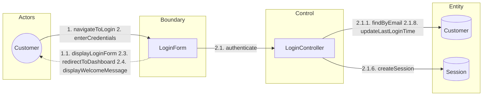
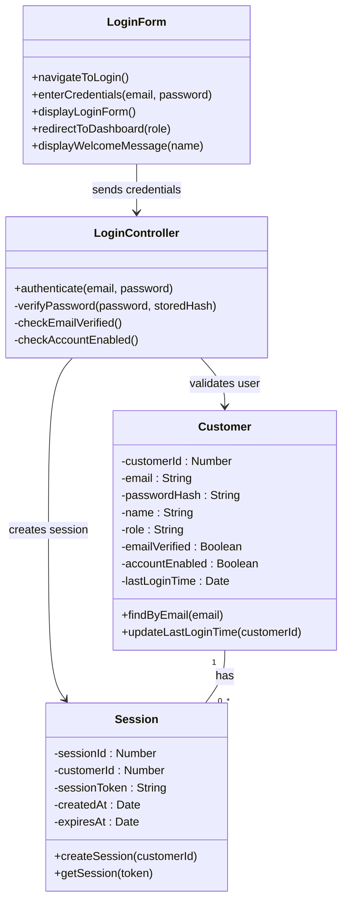
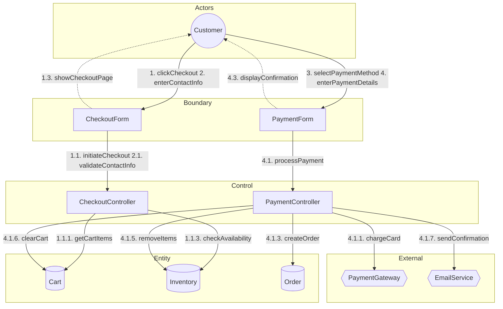
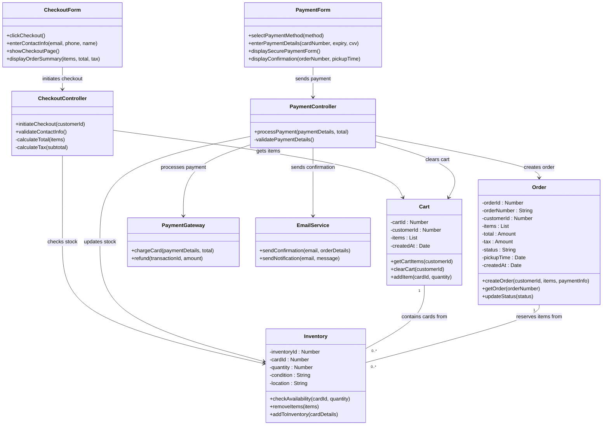
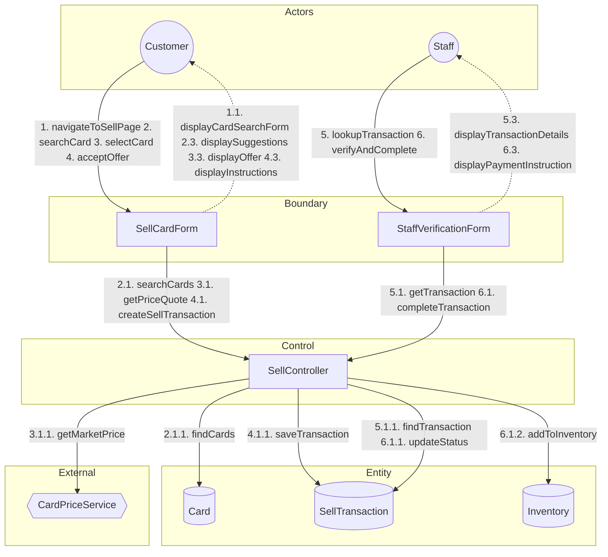
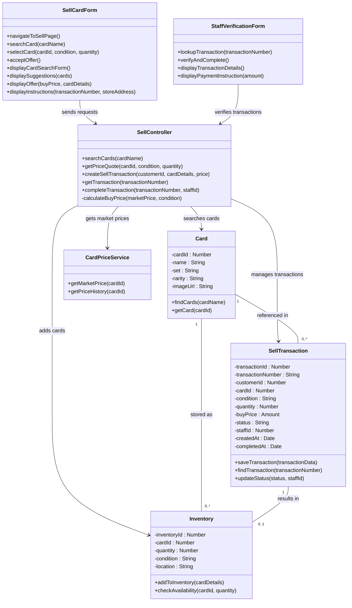

# CardHub: Collaboration and VOPC Diagrams

Levente Szabo - 618088

## 1. Customer Login

### Collaboration Diagram

The collaboration diagram shows how objects interact during the login process. Numbers indicate message sequence.

**Message Flow:**
- 1. Customer navigates to login page
  - 1.1. LoginForm displays the login form
- 2. Customer enters email and password
  - 2.1. LoginForm sends credentials to LoginController for authentication
    - 2.1.1. LoginController looks up customer by email
    - 2.1.3-2.1.5. LoginController verifies password and account status
    - 2.1.6. LoginController creates a new session
    - 2.1.8. LoginController updates last login time
    - 2.2-2.4. Success response flows back to customer

---

### VOPC Diagram

---

## 2. Customer Purchase Checkout

### Collaboration Diagram

**Message Flow:**
1. Customer clicks checkout
1.1. CheckoutController gets cart items and checks inventory
1.2-1.3. Order summary displayed to customer
2. Customer enters contact info for pickup
3-4. Customer enters payment details
4.1. PaymentController processes payment through gateway
4.1.3-4.1.6. Order created, inventory updated, cart cleared
4.1.7. Confirmation email sent
4.3. Confirmation displayed to customer

---

### VOPC Diagram

---

## 3. Sell Card to Store

### Collaboration Diagram

**Message Flow:**
1. Customer navigates to sell page
2. Customer searches for card, system shows matches
3. Customer selects card and condition, system calculates buy price
3.1.1. SellController fetches market price from external service
3.1.3. Buy price calculated (60% of market, adjusted for condition)
4. Customer accepts offer, transaction created
5. Staff looks up transaction when customer arrives
6. Staff verifies card and completes transaction
6.1.2. Card added to inventory

---

### VOPC Diagram

