# CardHub: Sequence Diagrams

Levente Szabo - 618088

---

This guy in the lecture slides was so funny to me that I just had to include him here.

---

## Customer Login

1. Customer navigates to the login page
2. Customer enters email and password
3. LoginController validates credentials against Customer entity
4. Session is created and stored
5. Customer is redirected to appropriate dashboard based on role

---

## Customer Purchase Checkout

1. Customer initiates checkout, system verifies cart items are in stock
2. Customer enters contact information for pickup
3. Customer enters payment details in secure form
4. Payment is processed through external gateway
5. Order is created, inventory updated, cart cleared
6. Confirmation email sent and displayed to customer

---

## Sell Card to Store

```mermaid
sequenceDiagram
    actor Customer
    participant SellCardForm as SellCardForm
    participant SellController as SellController
    participant CardPriceService as CardPriceService
    participant CardDB as Card
    participant TransactionDB as SellTransaction
    actor Staff
    participant StaffForm as StaffVerificationForm
    participant InventoryDB as Inventory

    Customer->>SellCardForm: 1. navigateToSellPage()
    SellCardForm-->>Customer: 1.1. displayCardSearchForm()

    Customer->>SellCardForm: 2. searchCard(cardName)
    SellCardForm->>SellController: 2.1. searchCards(cardName)
    SellController->>CardDB: 2.1.1. findCards(cardName)
    CardDB-->>SellController: 2.1.2. return matchingCards
    SellController-->>SellCardForm: 2.2. return cardSuggestions
    SellCardForm-->>Customer: 2.3. displaySuggestions(cards)

    Customer->>SellCardForm: 3. selectCard(cardId, condition, quantity)
    SellCardForm->>SellController: 3.1. getPriceQuote(cardId, condition, quantity)

    SellController->>CardPriceService: 3.1.1. getMarketPrice(cardId)
    CardPriceService-->>SellController: 3.1.2. return marketPrice

    SellController->>SellController: 3.1.3. calculateBuyPrice(marketPrice, condition)
    Note right of SellController: Buy = Market × 60%<br/>adjusted for condition

    SellController-->>SellCardForm: 3.2. return priceQuote(buyPrice)
    SellCardForm-->>Customer: 3.3. displayOffer(buyPrice, cardDetails)

    Customer->>SellCardForm: 4. acceptOffer()
    SellCardForm->>SellController: 4.1. createSellTransaction(customerId, cardDetails, price)

    SellController->>TransactionDB: 4.1.1. saveTransaction(transactionData)
    TransactionDB-->>SellController: 4.1.2. return transactionNumber

    SellController-->>SellCardForm: 4.2. return transactionCreated(transactionNumber)
    SellCardForm-->>Customer: 4.3. displayInstructions(transactionNumber, storeAddress)

    Note over Customer,Staff: Customer brings card to store

    Staff->>StaffForm: 5. lookupTransaction(transactionNumber)
    StaffForm->>SellController: 5.1. getTransaction(transactionNumber)
    SellController->>TransactionDB: 5.1.1. findTransaction(transactionNumber)
    TransactionDB-->>SellController: 5.1.2. return transactionDetails
    SellController-->>StaffForm: 5.2. return transactionDetails
    StaffForm-->>Staff: 5.3. displayTransactionDetails()

    Staff->>StaffForm: 6. verifyAndComplete()
    StaffForm->>SellController: 6.1. completeTransaction(transactionNumber, staffId)

    SellController->>TransactionDB: 6.1.1. updateStatus("Completed", staffId)
    SellController->>InventoryDB: 6.1.2. addToInventory(cardDetails)

    SellController-->>StaffForm: 6.2. return completionSuccess(paymentAmount)
    StaffForm-->>Staff: 6.3. displayPaymentInstruction(paymentAmount)
```

1. Customer searches for the card they want to sell
2. System looks up market price from external service
3. Buy price calculated (60% of market, adjusted for condition)
4. Customer accepts offer, transaction created with pending status
5. Customer brings card to store with transaction number
6. Staff verifies card condition and completes transaction
7. Card added to inventory, customer paid cash

