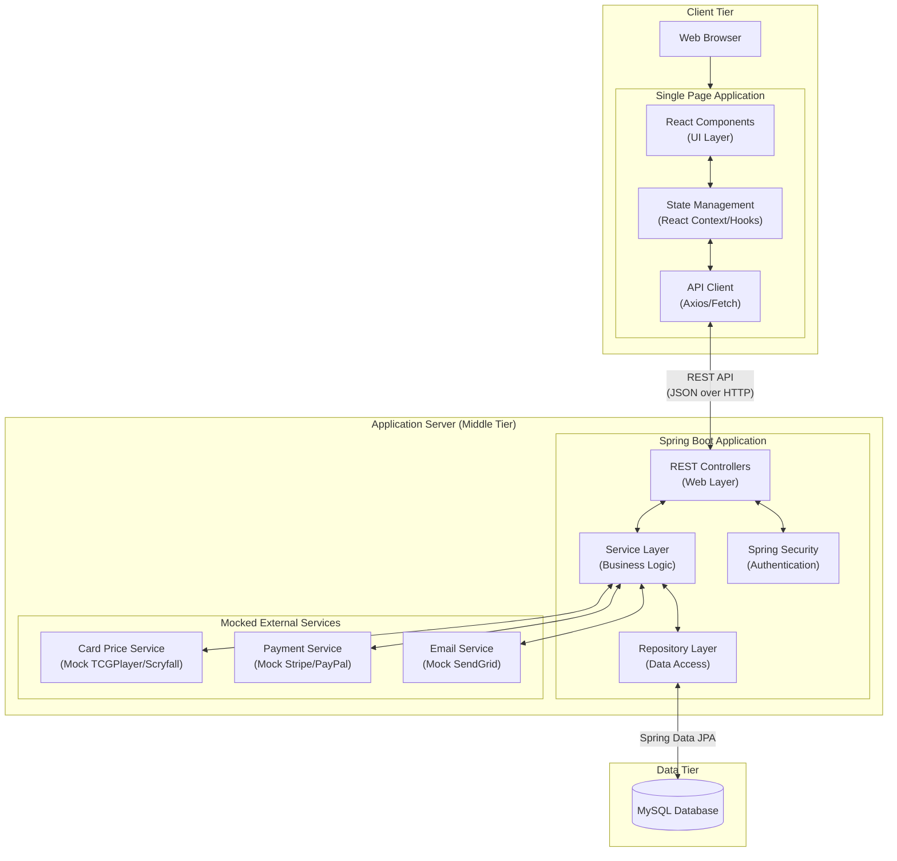

# CardHub System Architecture

## Overview

This document describes the high-level system architecture for CardHub, a playing card store application. The architecture follows a **3-tier design** that separates the client, application server, and data storage concerns.

## Architecture Diagram

## Physical Tiers

| Tier | Description | Technology |
|------|-------------|------------|
| **Client Tier** | User's web browser running the frontend application | Any modern web browser |
| **Middle Tier** | Application server hosting business logic and APIs | Java Spring Boot on application server |
| **Data Tier** | Database server storing all application data | MySQL database server |

## Logical Layers

### Client Tier Layers

| Layer | Purpose | Technology |
|-------|---------|------------|
| **UI Layer** | Displays pages and handles user interactions | React Components, HTML, CSS |
| **State Management** | Manages application state and data flow | React Context, Hooks |
| **API Client** | Sends requests to backend and handles responses | Axios or Fetch API |

### Middle Tier Layers

| Layer | Purpose | Technology |
|-------|---------|------------|
| **Web Layer** | Handles HTTP requests and routes them to services | Spring Boot REST |
| **Security Layer** | Manages authentication and authorization | Spring Security |
| **Service Layer** | External services and data | Serialized as POJOs |
| **Repository Layer** | Database operations | Spring JPA |

### External Services (Mocked)

| Service | Purpose | Mock Implementation |
|---------|---------|---------------------|
| **Card Price Service** | Fetches card prices from external sources | Might use https://docs.tcgplayer.com for this if I have time |
| **Payment Service** | Processes customer payments | Simulates payments |
| **Email Service** | Sends notifications to users | Will just log to console |

## Key Design Decisions

### Why 3-Tier Architecture?
- **Separation of concerns**: Each tier has a clear responsibility
- **Scalability**: Tiers can be scaled independently
- **Security**: Business logic is protected on the server
- **Familiarity**: I have the most experience with it

### Why Mock External Services?
- This is an educational project, no need for real services
- Allows testing without external dependencies
- Can be replaced with real services later
