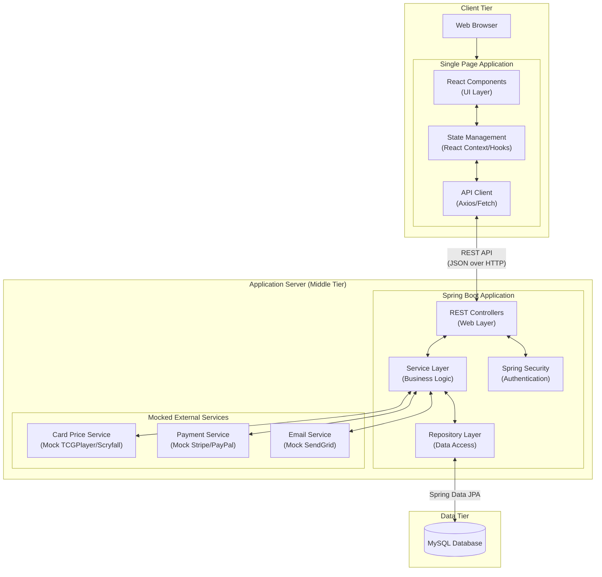

# Architecture Diagram

```mermaid
flowchart TB
    subgraph ClientTier["Client Tier"]
        Browser["Web Browser"]
        subgraph SPA["Single Page Application"]
            ReactUI["React Components<br/>(UI Layer)"]
            StateM["State Management<br/>(React Context/Hooks)"]
            APIClient["API Client<br/>(Axios/Fetch)"]
        end
    end

    subgraph MiddleTier["Application Server (Middle Tier)"]
        subgraph SpringBoot["Spring Boot Application"]
            Controllers["REST Controllers<br/>(Web Layer)"]
            Services["Service Layer<br/>(Business Logic)"]
            Repositories["Repository Layer<br/>(Data Access)"]
            Security["Spring Security<br/>(Authentication)"]
        end
        subgraph MockServices["Mocked External Services"]
            PriceMock["Card Price Service<br/>(Mock TCGPlayer/Scryfall)"]
            PaymentMock["Payment Service<br/>(Mock Stripe/PayPal)"]
            EmailMock["Email Service<br/>(Mock SendGrid)"]
        end
    end

    subgraph DataTier["Data Tier"]
        MySQL[("MySQL Database")]
    end

    Browser --> SPA
    ReactUI <--> StateM
    StateM <--> APIClient
    APIClient <-->|"REST API<br/>(JSON over HTTP)"| Controllers
    Controllers <--> Security
    Controllers <--> Services
    Services <--> Repositories
    Services <--> PriceMock
    Services <--> PaymentMock
    Services <--> EmailMock
    Repositories <-->|"Spring Data JPA"| MySQL
```

