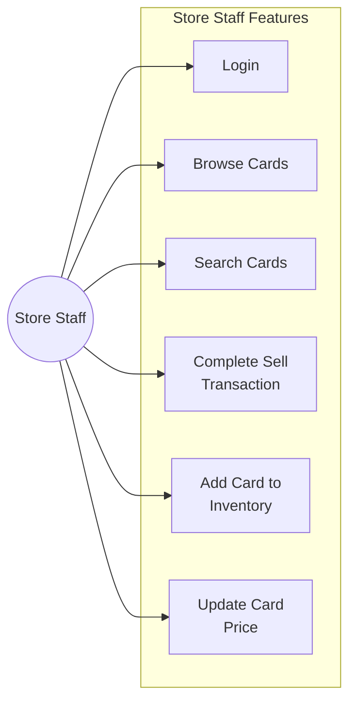

# CardHub: Use Case Diagrams

Levente Szabo - 618088

---

## 1. Overall System Use Case Diagram

This diagram shows all major use cases and the actors who interact with them.

---

## 2. Customer Use Cases

This diagram focuses on the features available to customers.

---

## 3. Store Staff Use Cases

This diagram shows the features available to store staff members.

---

## 4. Administrator Use Cases

This diagram shows the features available to administrators.

---

## Use Case Summary

| Use Case ID | Use Case Name | Primary Actor(s) | Description |
|-------------|---------------|------------------|-------------|
| UC-1 | Register Account | Customer | Create new customer account |
| UC-2 | Login | Customer, Staff, Administrator | Login to system |
| UC-3 | Browse Cards | Customer, Staff | Browse card inventory |
| UC-4 | Search Cards | Customer, Staff | Search for specific cards |
| UC-5 | Add to Cart | Customer | Add cards to shopping cart |
| UC-6 | Checkout and Pay | Customer | Complete purchase with in-store pickup |
| UC-7 | Get Price Quote | Customer | Get instant price quote to sell card |
| UC-8 | Complete Sell Transaction | Staff | Complete sell transaction in store |
| UC-9 | Add Card to Inventory | Staff, Administrator | Add card to inventory |
| UC-10 | Update Card Price | Staff, Administrator | Update price for a card |
| UC-11 | Post Trade Offer | Customer | Post offer on trading marketplace |
| UC-12 | Browse Trade Offers | Customer | Browse and contact traders |
| UC-13 | Post Tournament | Customer | Post tournament announcement and reserve room |
| UC-14 | View Tournaments | Customer | View upcoming tournaments |
