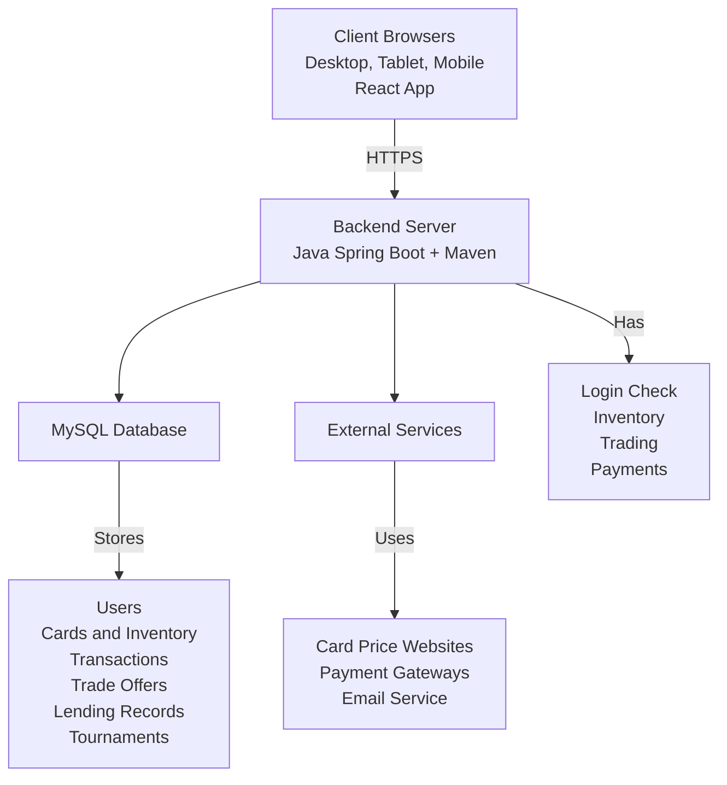

# Vision Document for "CardHub - Trading Card Store Management System"

Levente Szabo - 618088

---

## 1. Introduction

Trading card games like Magic: The Gathering, Pokémon, and Yu-Gi-Oh! have millions of players around the world. Local card stores are places where players can buy cards, sell cards, trade with others, and play in tournaments.

Right now, most card stores use many different tools to run their business. They use cash register software to sell cards. They use Excel sheets to track what cards they have. They keep binders with prices for cards they want to buy. They use bulletin boards or Facebook groups for customers to trade with each other. They use separate websites to tell people about tournaments. Using all these different systems causes problems:

- When a customer wants to sell cards, staff must look up each card price by hand and this takes a long time
- Customers can only trade with each other if they are both in the store at the same time
- Keeping track of thousands of cards and their prices is hard work and mistakes happen often
- The store cannot easily let customers borrow cards or decks
- Setting up tournaments takes a lot of time

CardHub is a new software tool that will help run all parts of a trading card store. The system will let:

- **Customers** look at what cards are for sale, buy and sell cards, make trade offers to other customers, borrow or lend cards and decks, and see what tournaments are coming up
- **Store Staff** add or remove cards from inventory, handle sales, set card prices, and do all store work from one system
- **Store Managers** see sales reports, manage user accounts, and change system settings
- **The Community** trade cards with each other and join tournaments

---

## 2. Positioning

### 2.1 Problem Statement

| The problem of | running a card store with many different systems that do not work together |
|---|---|
| **Affects** | card store owners, staff, customers, and players |
| **the impact of which is** | store work takes too much time, customers have a poor experience, the store misses chances to make money, and the store is hard to grow |
| **a successful solution would be** | one tool that does all store work including sales, trades between customers, card lending, and tournaments. This tool will have a database and a user interface that is easy to use for staff and customers. |

### 2.2 Product Position Statement

| For | card store owners and their customers |
|---|---|
| **Who** | need one simple system to run the store and let customers interact |
| **The CardHub** | is a trading card store management system |
| **That** | handles inventory, sales, customer-to-customer trades, card lending, and tournaments all in one place |
| **Unlike** | using cash register software, Excel sheets, bulletin boards, and separate tournament websites |
| **Our product** | keeps inventory updated in real-time, gets card prices from the internet, lets customers trade with each other, and works both in the store and online |

---

## 3. Stakeholder Descriptions

### 3.1 Stakeholder Summary

| Name | Description | Responsibilities |
|---|---|---|
| Store Administrators | Store owners and managers | Set up the system, manage user accounts, set pricing rules, see sales reports, set store policies |
| Store Staff | Employees who work at the store | Sell cards to customers, add or remove cards from inventory, check trade values, help with in-store pickups |
| Customers | Card collectors and players | Buy and sell cards, make trade offers, borrow or lend cards and decks, sign up for tournaments, manage their account |
| Tournament Organizers | Staff or community members who run events | Post tournament announcements, manage who signed up, post match results |
| System Developers | Team that builds the system | Build new features, fix bugs, keep the system safe and fast |
| Database Administrators | Technical staff who manage data | Keep database working, do backups, make queries fast, keep data safe |

### 3.2 User Environment

**Store Staff Environment:**
- Number of staff: Usually 2-5 employees working at the same time during busy hours
- How long tasks take: Selling a few cards takes 2 minutes. Buying a large collection from a customer takes 15-20 minutes
- What computers they use: Desktop computers at the counter, tablets on the store floor
- What they do at once: Help several customers, add cards to inventory, check online orders
- Other tools: May need to work with barcode scanners and receipt printers

**Customer Environment:**
- Who uses it: Casual collectors and serious players, from ages 10 to 50+
- Where they use it: In the store on kiosks or their phones, at home on computers or phones
- How good they are with computers: Some people are very good, some are beginners - the system must be easy for everyone
- How often they use it: Active traders use it every day. Casual users check it once a week or month
- How many at once: During busy times, 50-100+ people may be using the system at the same time

**System Needs:**
- Must work on desktop computers, tablets, and phones
- Inventory and trade offers must update right away
- Must handle payments safely
- Must search through 50,000+ cards quickly

---

## 4. Product Overview

### 4.1 Product Perspective

CardHub is a web application with three main parts:

1. **Web Pages** (React)
   - Customer pages to browse cards, trade, and buy
   - Staff pages to manage inventory and sales
   - Admin pages to change settings and see reports

2. **Server** (Java Spring Boot)
   - Handles all the business rules
   - Checks who can log in and what they can do
   - Gets card prices from the internet (TCGPlayer, Scryfall)

3. **Database** (MySQL)
   - Stores cards and their prices
   - Stores user accounts and sales history
   - Stores trade offers and lending records
   - Stores tournament information

**Works With Other Systems:**
- Card price websites to get current market values
- Payment systems like Stripe or PayPal for online purchases
- Email service to send notifications
- May work with barcode scanners and receipt printers later

### 4.2 Assumptions and Dependencies

**Assumptions:**
1. Users have modern web browsers (Chrome, Firefox, Safari, or Edge from the last 2 years)
2. The store has good internet connection
3. Card price websites will stay available and keep the same format
4. Card prices can be saved and updated every hour or every day instead of checking every time
5. The card database can be filled with data from TCGPlayer and Scryfall websites
6. Payments will be handled by Stripe or PayPal

**What We Need:**
1. Java Development Kit (JDK 17 or newer)
2. Node.js and npm to build the web pages
3. MySQL database (version 8.0 or newer)
4. Access to card price websites (will be mocked)
5. Payment account with Stripe or PayPal (will be mocked)
6. Email service like SendGrid or AWS SES (will be mocked)
7. Web server with enough space and speed

### 4.3 Needs and Features

| No | Problem | Need | Priority | Features | Planned Release |
|---|---|---|---|---|---|
| **Store Inventory Management** |||||
| 1 | Store has thousands of cards from different games | Track many cards easily | High | Admin and Staff can add cards with game name, set name, condition, how many, and price. Can add many cards at once. | 1.0 |
| 2 | Card prices go up and down | Prices should match the market | High | System gets card prices from the internet. Staff can set rules like "buy at 60% of market price, sell at 80%". Prices update automatically. | 1.0 |
| 3 | Cards come in different conditions (mint, near-mint, played, damaged) | Track condition and price by condition | Medium | Each card in inventory has a condition. Price changes based on condition. | 1.0 |
| 4 | Must not sell the same card twice | Inventory must update right away | High | When a card is sold or traded, inventory updates immediately. This stops two people from buying the same card. | 1.0 |
| 5 | Need to organize by game, set, rarity, card type | Good search and filter | High | Search cards by game (MTG, Pokemon, etc.), set, rarity, card type, artist, color, mana cost, etc. | 1.0 |
| **Customer Purchase System** |||||
| 6 | Customers want to buy cards online | Online store with shopping cart | High | Customers can look at cards, add them to a cart, and buy them. Can buy as a guest or with an account. | 1.0 |
| 7 | Customers need safe payment | Payment system | High | Uses Stripe or PayPal. Takes credit cards and debit cards. Sends email when order is complete. | 1.0 |
| 8 | Customers want to see what they bought before | Order history | Medium | Users can see past orders, download receipts, see if order is pending, completed, or shipped. | 1.0 |
| 9 | Customers want to save cards for later | Wishlist | Low | Users can add cards to a wishlist. Get email when prices drop or card is back in stock. | 2.0 |
| **Sell to Store System** |||||
| 10 | Customers want to sell cards to the store | Sell cards interface | High | Customers enter what cards they want to sell. System looks up market price and shows what the store will pay. Staff checks and approves. | 1.0 |
| 11 | Store must check card condition before buying | Approval process | High | Customer makes sell offer online. Brings cards to store. Staff checks condition and finishes sale or changes offer. | 1.0 |
| 12 | Customer should get paid different ways | Payment options | Medium | Customer can choose store credit (with bonus %), cash, or bank payment. Store credit is saved in their account. | 1.0 |
| **Store Trading System** |||||
| 13 | Customers want to trade cards with the store | Trade system | High | Customer picks cards to trade in and cards they want from the store. System shows the value difference. Customer pays difference or gets credit back. | 1.0 |
| 14 | Trade values should match market prices | Trade price calculation | High | Trade page shows current trade-in values and store prices. Adds up the trade automatically. | 1.0 |
| **Peer-to-Peer Trading** |||||
| 15 | Customers want to trade with other customers | Customer trade offers | Medium | Customers can post trade offers saying what cards they have and what cards they want. Other customers can look at offers and accept them. | 1.0 |
| 16 | Trade offers should stay until someone accepts or cancels | Manage trade offers | Medium | Users can create, edit, or cancel trade offers. See their offers and requests from others. Get notification when someone wants to trade. | 1.0 |
| 17 | Trades should happen in the store for safety | In-store trade check | Medium | Store staff watches the trade happen and marks it complete in the system. This stops fraud. | 1.0 |
| 18 | Users want to know if other traders are good | User ratings | Low | After a trade, users can rate each other. Ratings show up on trade offers. | 2.0 |
| **Borrowing and Lending** |||||
| 19 | Customers want to borrow expensive cards or decks for tournaments | Lending system | Medium | Customers can ask to borrow cards or full decks. Set how long to borrow and how much deposit. | 1.5 |
| 20 | Store needs money held for borrowed items | Deposit system | Medium | Customer pays deposit based on card value. They get it back when they return the cards. System tracks when cards are due. Sends reminders. Charges late fees. | 1.5 |
| 21 | Track what is borrowed and when it is due back | Manage lending | Medium | Staff can see all active loans, what is late, and history. System sends reminders before due date. | 1.5 |
| 22 | Customers might lend to each other | Customer lending | Low | Customers can rent cards or decks to other customers. System helps make the agreement and tracks when cards come back. | 2.0 |
| **Tournament System** |||||
| 23 | Store runs tournaments and needs to tell people about them | Tournament announcements | Medium | Staff can create tournament events with date, format, entry fee, and prizes. Show calendar of upcoming events. | 1.0 |
| 24 | Players need to sign up for tournaments | Tournament sign up | Medium | Customers can register for tournaments online. System keeps list of who signed up. Stops sign up when tournament is full. | 1.0 |
| 25 | Organizers need to run brackets and record results | Tournament management | Low | Make brackets, record who won each match, show standings. Let players submit their decks. | 2.0 |
| 26 | Keep tournament history and player stats | Tournament history | Low | Save past tournament results. Track how players do over time and show rankings. | 2.0 |
| **User Account Management** |||||
| 27 | Users need safe login | User accounts | High | Sign up with email and password. Passwords are stored safely. Can reset password. Must verify email. | 1.0 |
| 28 | Different users can do different things | User roles | High | Customer, Staff, and Admin roles. Staff can manage inventory. Admins can change settings. | 1.0 |
| 29 | Users want to track their own collection | Collection tracking | Low | Users can mark cards as owned. Keep a list of their collection. See how much it is worth over time. | 2.0 |
| **Administrative Features** |||||
| 30 | Admins need to set store rules | Settings | Medium | Set store hours, how much to pay for cards, lending rules, tax rates, shipping costs, etc. | 1.0 |
| 31 | See how the business is doing | Reports | Low | See sales over time, what cards sell best, what is popular, money made. Download data for taxes. | 2.0 |
| 32 | Manage users | User management | Medium | Admins can see, edit, or turn off user accounts. Set staff permissions. Help solve problems. | 1.0 |

### 4.4 Alternatives and Competition

**Other Options:**

1. **TCGPlayer Seller Platform**
   - Good: Well known marketplace, many customers, has card prices
   - Bad: Takes 10-15% of each sale, does not work in store, no lending, limited community features

2. **Cash Register Systems (Square, Shopify)**
   - Good: Handle payments well, track inventory, make reports
   - Bad: Not made for cards, no customer trading, no lending, no tournament tools

3. **Excel Sheets**
   - Good: Free, full control
   - Bad: Takes a lot of time, easy to make mistakes, no website, bad customer experience

4. **Mix of Tools (Cash register + Facebook + Excel)**
   - Good: Can use tools you already know
   - Bad: Nothing works together, data does not match between tools, lots of manual work, looks unprofessional

**Why CardHub is Better:**
- Made just for card stores
- Everything in one place instead of many tools
- Has customer-to-customer trading and lending which other systems do not have
- Tournaments work with inventory and community
- Costs less than paying marketplace fees
- Store keeps all customer data
- Can change it to fit your store rules

---

## 5. Other Product Requirements

### 5.1 System Requirements

**What it runs on:**
- Web application that works in web browsers
- Works on desktop computers, tablets, and phones
- Server: Linux or Windows with Java 17 or newer
- Database: MySQL 8.0 or newer
- Browser: Chrome, Firefox, Safari, or Edge from the last 2 years

### 5.2 Performance Requirements

- Pages load in less than 2 seconds. Card searches take less than 5 seconds
- Search through 50,000+ cards in less than 1 second
- At least 100 people can use it at the same time
- Handle 10,000+ sales per day
- Most operations finish in less than half a second
- System is up 99.5% of the time (not counting when we update it)

### 5.3 Security Requirements

- All data is encrypted when sent over the internet (HTTPS)
- Passwords are stored safely (bcrypt)
- Follows payment card rules (PCI-DSS) by using Stripe or PayPal
- Stops SQL injection attacks
- Stops XSS attacks
- Stops CSRF attacks
- User roles control what people can do
- Sessions are secure
- Regular security checks and updates

### 5.4 Usability Requirements

- Easy to use - customers do not need training
- Staff need less than 2 hours of training
- Follows accessibility rules (WCAG 2.1 Level AA)
- Error messages are clear and helpful
- Ask before deleting things
- Show loading and success messages

### 5.5 Data Requirements

- Keep record of all sales
- Keep sales records for at least 7 years (for taxes)
- Backup database every day. Keep backups for 30 days
- Can export data to CSV or JSON files
- Delete user data when requested (but keep sales records for taxes)

### 5.6 Documentation Requirements

- Help pages for customers
- Training guide for staff with pictures
- Setup guide for admins
- API docs if we add integrations later
- Database design docs
- How to install and run the system

### 5.7 Quality Attributes

| Attribute | Requirement | Priority |
|---|---|---|
| Reliability | Up 99.5% of the time, handles errors well | High |
| Maintainability | Code is organized well and has comments | High |
| Testability | 80%+ of code has tests | High |
| Scalability | Can grow to handle more users | Medium |
| Extensibility | Can add new card games later | Medium |
| Portability | Can run in Docker | Low |

