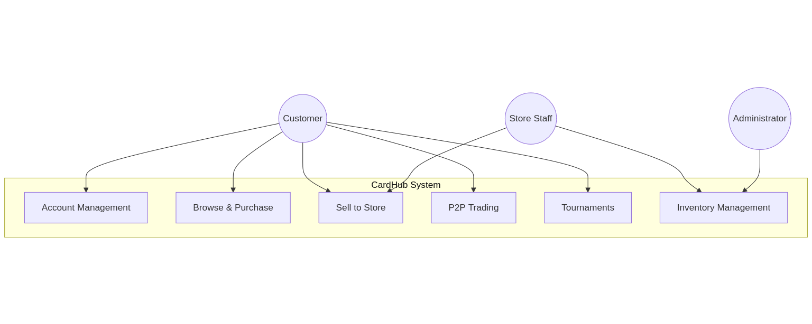

# CardHub
## Trading Card Store Management System

**Levente Szabo - 618088**
**CS425 - System Requirements Analysis**

---

# The Problem

**Trading card stores struggle with:**
- Managing inventory across multiple games
- Tracking customer purchases and sales
- Organizing community events
- Providing a platform for peer-to-peer trading

**CardHub simplifies store operations and builds community**

---

# System Use Cases

---

# Key Features

**For Customers:**
- Browse and buy cards online (in-store pickup)
- Sell cards to the store for cash
- Trade cards with other customers
- Post and join tournaments

**For Staff:**
- Manage card inventory
- Complete customer sell transactions
- Update card prices

---

# Next Steps

**Completed:**
✓ Vision Document
✓ Use Case Model (6 major use cases)

**Coming Soon:**
- Full system design
- Database schema
- UI mockups
- Implementation

---
