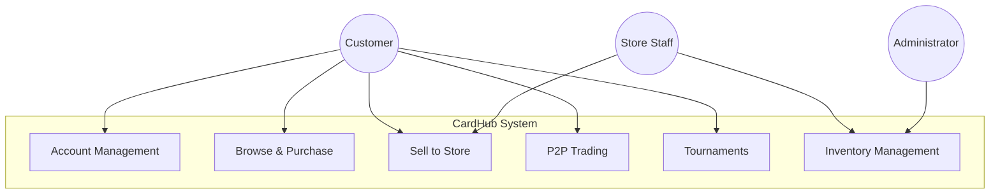

```mermaid
graph TB
    Customer((Customer))
    Staff((Store Staff))
    Admin((Administrator))

    subgraph CardHub["CardHub System"]
        UC1[Account Management]
        UC2[Browse & Purchase]
        UC3[Sell to Store]
        UC4[P2P Trading]
        UC5[Tournaments]
        UC6[Inventory Management]
    end

    Customer --> UC1
    Customer --> UC2
    Customer --> UC3
    Customer --> UC4
    Customer --> UC5

    Staff --> UC3
    Staff --> UC6
    Admin --> UC6
```
